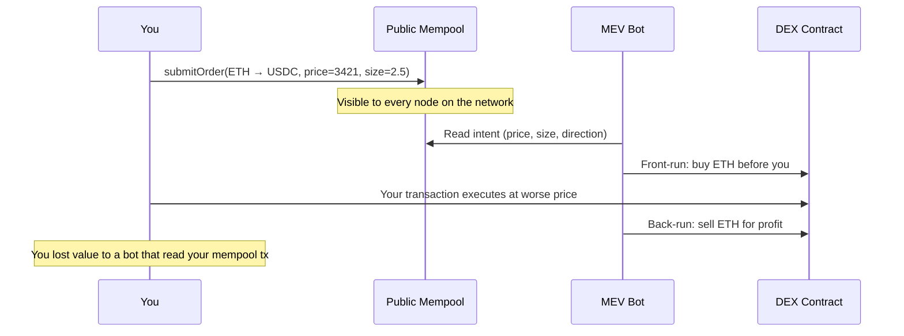
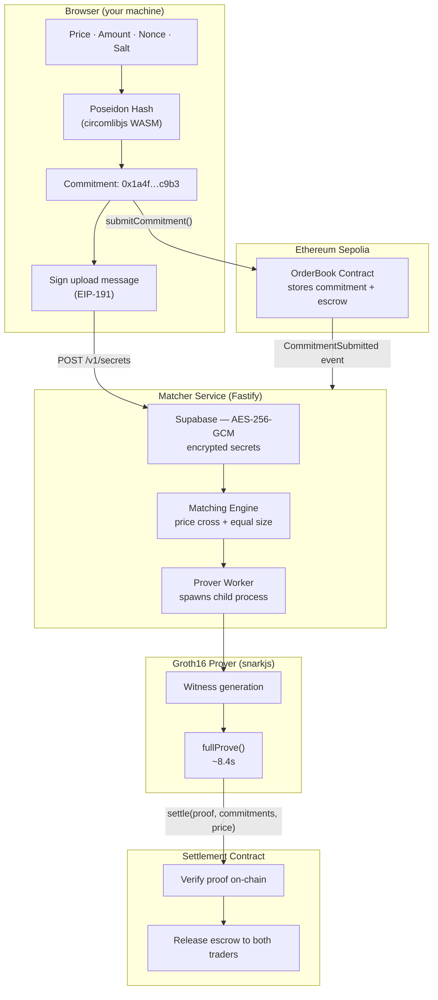
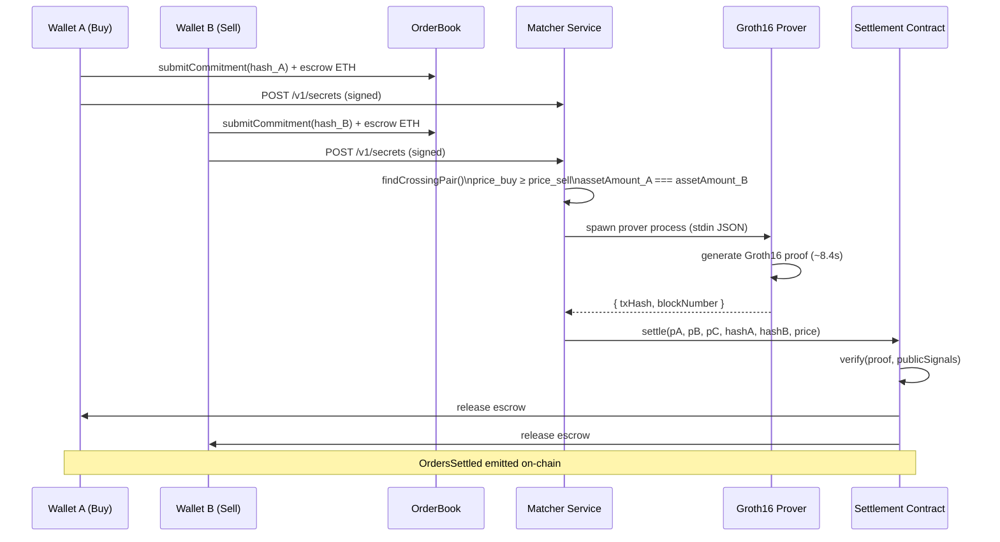
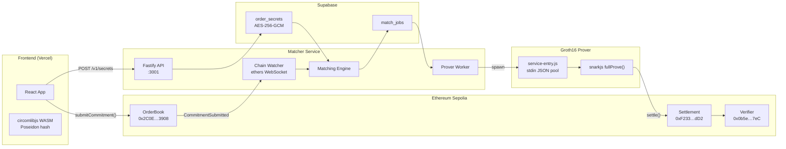
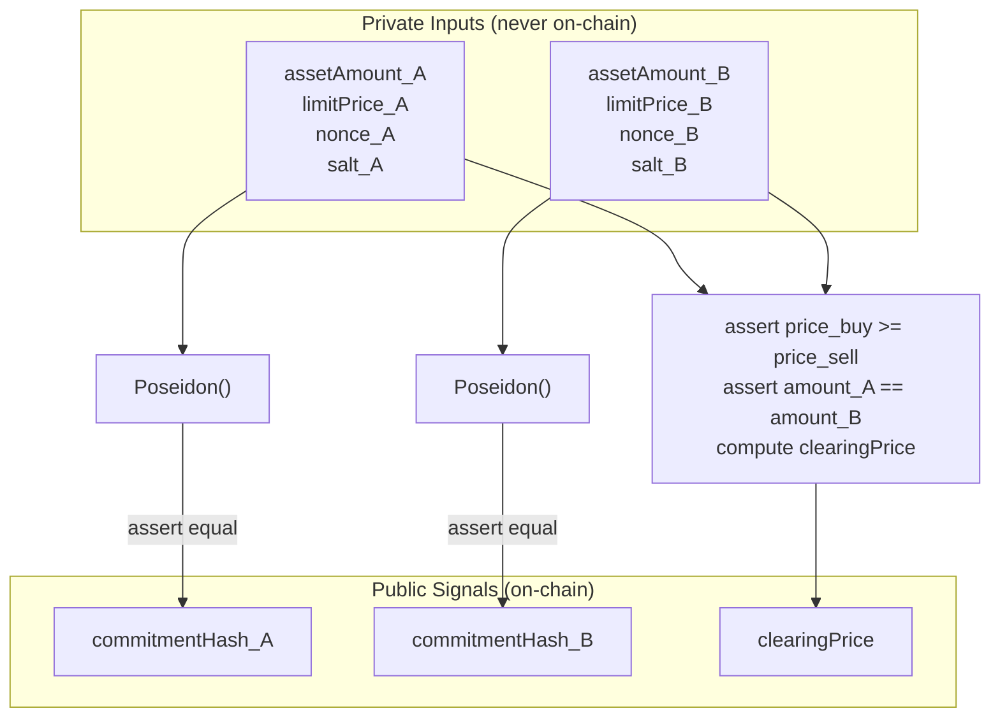
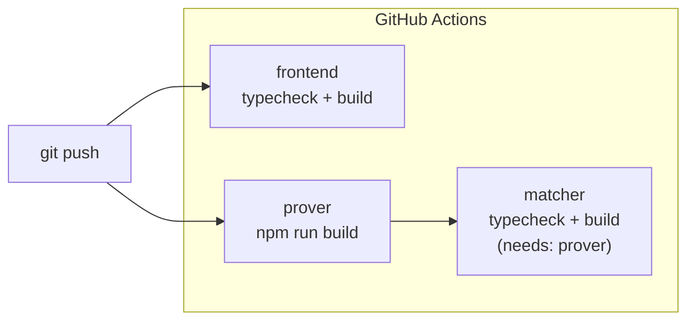

<div align="center">
  

  <h1>ShadowPool</h1>

  <p><strong>Private orders. Verified settlement. Zero front-running.</strong></p>

  <p>
    <a href="https://vamshiganesh.github.io/ShadowPool/"><strong>Project Homepage</strong></a>
    &nbsp;·&nbsp;
    <a href="https://shadowpool-eight.vercel.app/"><strong>Live App</strong></a>
    &nbsp;·&nbsp;
    <a href="https://youtu.be/SRvq2ZG-bUg"><strong>Watch Demo</strong></a>
    &nbsp;·&nbsp;
    <a href="https://sepolia.etherscan.io/tx/0x33225b04d725dd77d19f238dae3b97e07851a12639e65e7e4808a8487286cce9"><strong>Live Settlement TX</strong></a>
    &nbsp;·&nbsp;
    <a href="DEPLOY.md"><strong>Setup Guide</strong></a>
  </p>

  <p><sub>GitHub README links open in the same tab. Use <a href="https://vamshiganesh.github.io/ShadowPool/">Project Homepage</a> for links that open in a new tab.</sub></p>

  <br />

  
  
  
  
  
</div>

---

Every trade you submit to a public DEX is broadcast in plaintext to every node in the network before it executes. Searcher bots read that stream and systematically extract value from your transaction before it confirms. This is not an edge case — it is the default behavior of transparent blockchains.

ShadowPool replaces that broadcast with a cryptographic commitment. Your order intent — price, size, direction — is hashed locally using a Poseidon function and submitted on-chain as an opaque fingerprint. An off-chain matching engine pairs crossing orders without ever seeing plaintext. A Groth16 zero-knowledge proof demonstrates that the match is valid. Settlement executes atomically on Sepolia.

No mempool exposure. No front-running surface. Full verifiability.

---

## Table of Contents

- [Demo](#demo)
- [The Problem](#the-problem)
- [How It Works](#how-it-works)
- [Settlement Lifecycle](#settlement-lifecycle)
- [By the Numbers](#by-the-numbers)
- [Technology Stack](#technology-stack)
- [Architecture](#architecture)
- [Circuit Design](#circuit-design)
- [Repository Structure](#repository-structure)
- [Deployed Contracts](#deployed-contracts)
- [Getting Started](#getting-started)
- [CI Pipeline](#ci-pipeline)
- [Security Notes](#security-notes)
- [License](#license)

---

## Demo

<p align="center">
  <a href="https://youtu.be/SRvq2ZG-bUg">
    
  </a>
</p>

<p align="center">
  <a href="https://youtu.be/SRvq2ZG-bUg"><strong>Watch on YouTube</strong></a>
  &nbsp;·&nbsp;
  <a href="https://shadowpool-eight.vercel.app/"><strong>Live App on Vercel</strong></a>
  &nbsp;·&nbsp;
  <a href="https://sepolia.etherscan.io/tx/0x33225b04d725dd77d19f238dae3b97e07851a12639e65e7e4808a8487286cce9"><strong>Live Settlement on Sepolia</strong></a>
</p>

The demo covers both wallets committing orders, the signature-gated secret upload, automatic matching, Groth16 proof generation (~8s), and the atomic `OrdersSettled` event confirming on Sepolia.

---

## The Problem



The 12 seconds between submitting a transaction and it being mined are a wide-open attack window. Searchers run sophisticated bots that detect profitable trades and insert their own transactions ahead of yours using higher gas fees. This is structural, not accidental.

ShadowPool closes that window entirely by never broadcasting the trade intent in the first place.

---

## How It Works



Five steps. The only information that ever touches a public network is the Poseidon hash.

---

## Settlement Lifecycle



From second commit to on-chain settlement in under 30 seconds on Sepolia (network latency + ~8s proof time + 1 block confirmation).

---

## By the Numbers

| Metric | Value |
|--------|-------|
| R1CS Constraints | 1,746 |
| Average Proof Time | 8.4s |
| Gas per Settlement | ~142,000 |
| Proving System | Groth16 (BN128 curve) |
| Encryption at Rest | AES-256-GCM |
| Signature Auth | EIP-191 personal_sign |
| Deployment | Ethereum Sepolia |
| CI Jobs | 3 (frontend · prover · matcher) |

**What makes this end-to-end:**

- The circuit and the matcher share the same matching rules. A pair that does not satisfy price crossing and equal amounts will never reach the prover, because the matcher enforces both constraints before creating a job.
- Secrets are encrypted at rest. Supabase only holds ciphertext. The `MATCHER_SECRET_KEY` is the only path to decryption.
- The prover wallet is completely separate from trader wallets. It pays settlement gas; it never holds user funds.
- Every proof that passes `Settlement.settle()` is a Groth16 proof verified by a Solidity verifier generated directly from the circuit's proving key. There is no trusted execution environment or multisig shortcut.

---

## Technology Stack

| Layer | Technology | Role |
|-------|------------|------|
| ZK Circuit | Circom 2, circomlibjs | Poseidon hash, commitment formation, match validation |
| Prover | snarkjs, Groth16, BN128 | Browser-side commitment computation + server-side proof |
| Frontend | React 19, Vite, TypeScript | Trading terminal, docs, landing page |
| Wallet | wagmi, viem, MetaMask | On-chain interaction, signing |
| Matcher API | Fastify, Zod | Secret upload, status polling, CORS auth |
| Database | Supabase (Postgres) | Encrypted order secrets, match job queue |
| Prover worker | Node.js child process | CPU-isolated proof generation |
| Contracts | Solidity, ethers.js v6 | Commitment, escrow, settlement, verification |
| Chain watcher | ethers.js WebSocket | Live `CommitmentSubmitted` event subscription |
| CI | GitHub Actions | Frontend build · prover build · matcher typecheck |
| Container | Docker (multi-stage) | Prover + matcher in one image |

---

## Architecture



---

## Circuit Design

The ZK circuit (`shadowpool_match.circom`) proves exactly two statements without revealing either input:

**1. Commitment validity** — each trader's commitment hash is the Poseidon hash of their private inputs (amount, price, nonce, salt). The prover knows the preimage; the verifier knows only the hash.

**2. Match validity** — the two orders satisfy the crossing condition: `price_buy >= price_sell` and `assetAmount_A == assetAmount_B`. The clearing price is the midpoint.



**1,746 R1CS constraints.** The circuit is compiled with Circom 2 and uses the standard BN128 curve. The proving key lives server-side only; the frontend runs Poseidon computation via circomlibjs WASM to form the commitment before any on-chain action.

---

## Repository Structure

```
ShadowPool/
├── circuits/                     ZK circuit source and build artifacts
│   └── shadowpool_match.circom   Poseidon commitment + match constraint
├── contracts/                    Solidity contracts
│   ├── OrderBook.sol             Commitment registry + escrow
│   ├── Settlement.sol            Groth16 verification + fund release
│   └── Verifier.sol              Auto-generated from snarkjs
├── prover/                       TypeScript Groth16 prover
│   ├── src/matcher.ts            Order pairing logic (mirrors matcher)
│   ├── src/prover.ts             snarkjs fullProve wrapper
│   ├── src/submitter.ts          On-chain settlement submission
│   └── src/service-entry.ts     stdin JSON entrypoint for child process
├── services/matcher/             Automated backend service
│   ├── src/routes/               POST /v1/secrets · GET /v1/status/:hash
│   ├── src/engine/matcher.ts     Bid/ask crossing + amount rule
│   ├── src/engine/worker.ts      Prover child process manager
│   ├── src/chain/watcher.ts      ethers.js WebSocket event subscription
│   ├── src/crypto/aes.ts         AES-256-GCM encrypt/decrypt
│   └── Dockerfile                Multi-stage: prover build → matcher build
├── src/                          Frontend (React + Vite)
│   ├── features/landing/         Marketing site
│   ├── features/trade/           Trading terminal
│   ├── features/orders/          Order history
│   ├── features/stats/           Protocol stats dashboard
│   └── features/docs/            Protocol documentation
├── shared/addresses.json         Deployed contract addresses
├── supabase/migrations/          DB schema (order_secrets + match_jobs)
├── .github/workflows/ci.yml      3-job CI pipeline
├── README.md                     This file
└── DEPLOY.md                     Full setup and deployment guide
```

---

## Deployed Contracts

All three contracts are verified on Sepolia Etherscan.

| Contract | Address |
|----------|---------|
| OrderBook | [`0x2C0E2bC142514f6B0200112049FD21D9519B3908`](https://sepolia.etherscan.io/address/0x2C0E2bC142514f6B0200112049FD21D9519B3908) |
| Settlement | [`0xF233DBDeb51c7cD7Ee69AC83Ad7cE698c5B62dD2`](https://sepolia.etherscan.io/address/0xF233DBDeb51c7cD7Ee69AC83Ad7cE698c5B62dD2) |
| Groth16 Verifier | [`0x0b5e7E4443CFF7745fb8B28E1E7fdeEBc99bB7eC`](https://sepolia.etherscan.io/address/0x0b5e7E4443CFF7745fb8B28E1E7fdeEBc99bB7eC) |

**Live settlement transaction:**
[`0x33225b04d725dd77d19f238dae3b97e07851a12639e65e7e4808a8487286cce9`](https://sepolia.etherscan.io/tx/0x33225b04d725dd77d19f238dae3b97e07851a12639e65e7e4808a8487286cce9)

The calldata contains a full Groth16 proof (`pA`, `pB`, `pC` — G1, G2, G1 points on BN128), both commitment hashes, and the clearing price. The `OrdersSettled` and two `CommitmentSettled` events confirm both traders received their escrowed ETH.

---

## Getting Started

Full instructions are in [DEPLOY.md](DEPLOY.md). The short version:

```bash
# Clone and install
git clone https://github.com/vamshiganesh/ShadowPool.git
cd ShadowPool && npm install

# Configure environment
cp .env.example .env
# Fill in VITE_SEPOLIA_RPC_URL and matcher credentials

# Build the prover (required before starting matcher)
cd prover && npm install && npm run build && cd ..

# Terminal 1: frontend
npm run dev

# Terminal 2: matcher
cd services/matcher && npm install && npm run dev

# Health check
curl http://localhost:3001/health
```

**For a full settlement demo** you need two MetaMask accounts on Sepolia, Sepolia ETH in both, and the matcher running. Use the same amount on both wallets (e.g. 2.5 ETH) with crossing prices. See [DEPLOY.md — Try a full settlement](DEPLOY.md#try-a-full-settlement-two-wallets) for the step-by-step walkthrough including what each MetaMask popup is asking.

---

## CI Pipeline

Three independent jobs run on every push and pull request to `main`. The matcher job requires the prover to finish first because the matcher worker spawns `prover/dist/service-entry.js` at runtime.



---

## Security Notes

ShadowPool is a research and portfolio demonstration on Ethereum Sepolia. It is not audited for mainnet production use.

| Topic | Detail |
|-------|--------|
| Smart contract audit | Not conducted |
| Circuit audit | Not conducted |
| Secret storage | Encrypted with AES-256-GCM; Supabase holds ciphertext only |
| Prover key exposure | The `.zkey` file stays server-side; the frontend never receives it |
| Trader auth | EIP-191 signature verified server-side before secrets are stored |
| Prover wallet | Separate from all trader wallets; pays gas only, holds no user funds |
| Front-running on Sepolia | Testnet validators do not run MEV bots; behavior is illustrative of mainnet architecture |

---

## License

MIT
